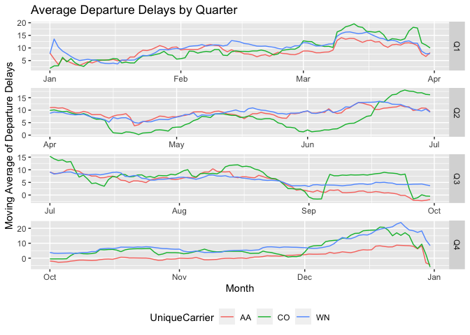
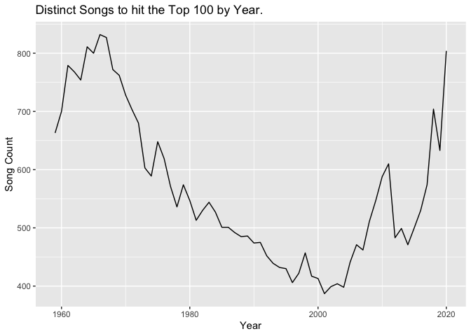
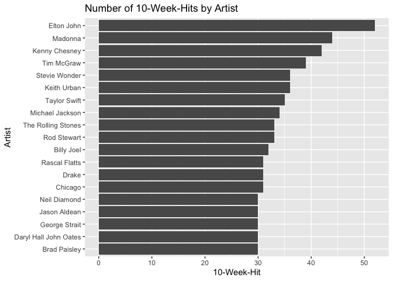
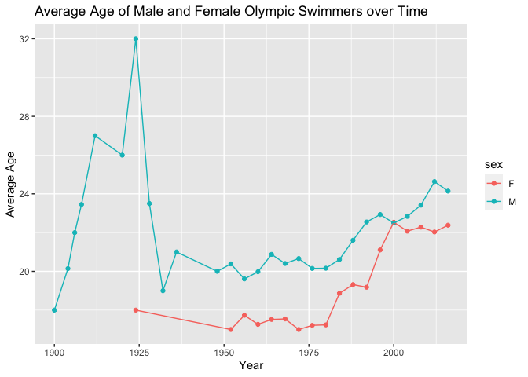
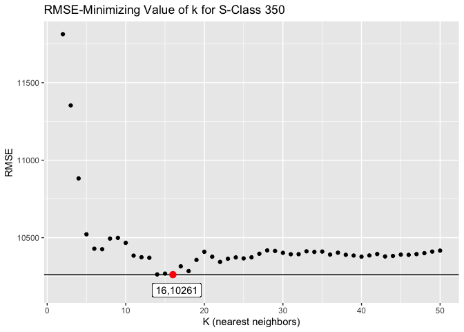
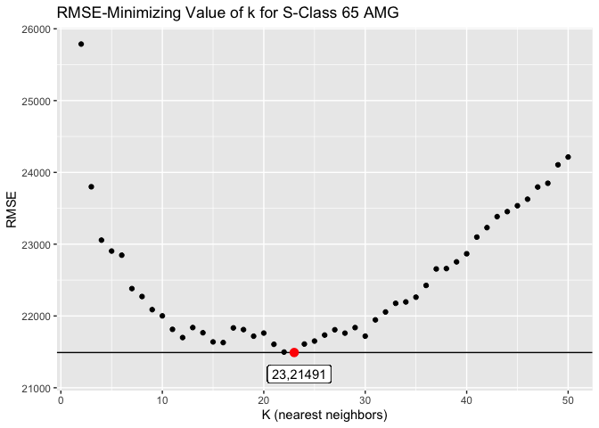
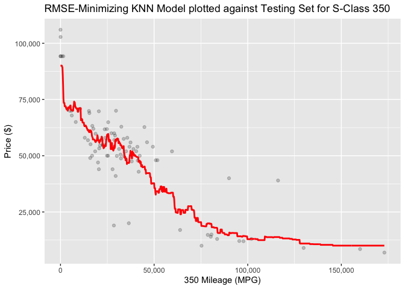
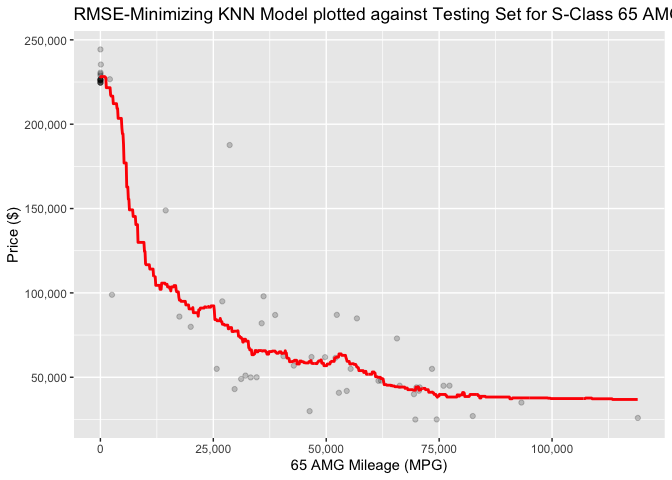

**Flights from ABIA**

\*The question we chose to investigate was which airline exhibited the
best performance at Austin-Bergstrom airport in the year 2008. The
criterion selected to measure performance was the daily average
departure delay. This seemed to be the more appropriate metric of
airline efficiency as opposed to arrival delays, as arrivals are
affected by variance factors outside of the airline’s control, such as
mid-flight weather and atmospheric conditions. The number of other
planes on the tarmac at the destination airport, which influences taxi
times, can further exacerbate arrival delays. Delays were chosen as the
method of scoring as they are one of the primary factors (among those
available in this data set) affecting people’s flight experience.

    #Find Most Frequent Fliers at Austin Airport

    UniqueIDs = ABIA %>%
      group_by(UniqueCarrier)%>%
      summarize(count=n())%>%
      arrange(desc(count))

\*The airlines that logged the most via Austin-Bergstrom airport were
Southwest (IATA code: WN), American Airlines (IATA code: AA), and
Continental (IATA code: CO). These airlines completed 34,876, 19,995,
and 9,230 flights, respectively. The decision was made to restrict the
set of airlines analyzed to only three, not just in the interest of
visual clarity, but also since the flight count for all the remaining
airlines was below 5,000 flights

    #Create subset with Top Airlines

    ABIA = ABIA %>% 
      mutate(full_date = dmy(paste(DayofMonth, Month, Year)))

    TopCarriers = ABIA %>%
    filter(Origin == "AUS", UniqueCarrier == 'WN' | UniqueCarrier == 'AA'| UniqueCarrier == 'CO') %>% 
      group_by(UniqueCarrier, full_date) %>%
      summarize(avg_dep_delay = mean(DepDelay, na.rm=T), .groups = "keep")

    #Define Feature Quarter
    Q1 = interval(ymd("2008-01-01"), ymd("2008-03-31"))
    Q2 = interval(ymd("2008-04-01"), ymd("2008-06-30"))
    Q3 = interval(ymd("2008-07-01"), ymd("2008-09-30"))
    Q4 = interval(ymd("2008-10-01"), ymd("2008-12-31"))

    TopCarriers = TopCarriers %>% mutate(Quarter= ifelse(
      full_date %within%(Q1), 'Q1', ifelse(
        full_date %within%(Q2), 'Q2', ifelse(full_date %within% (Q3), 'Q3', 'Q4'))
    ))

\*The year was divided into 4 quarters for vizualizing relavant travel
periods throughout the year.

    #Create Moving Average Function
    tapermean <- function(x, width=20){
      taper <- pmin(width,
                    2*(seq_along(x))-1,
                    2*rev(seq_along(x))-1) 
      lower <- seq_along(x)-(taper-1)/2    
      upper <- lower+taper                
      x <- c(0, cumsum(x))                 
      return((x[upper]-x[lower])/taper)} 

    TopCarriers = TopCarriers %>%
      group_by(UniqueCarrier) %>% 
      mutate(moving_avg = tapermean(avg_dep_delay))

    #Plot Moving Average
    ggplot(TopCarriers, aes(x=full_date, y=moving_avg, color=UniqueCarrier)) + 
      geom_line() +
      facet_wrap(~Quarter, nrow = 4, scales = "free", strip.position = "right") +
      theme(legend.position = "bottom") + ggtitle("Average Departure Delays by Quarter") +
      labs(x= "Month", y = "Moving Average of Departure Delays")

\*The graph above plots the 20-day tapered moving average of mean
departure delay for the three airlines over the course of the year. We
chose to implement a moving average to smooth out the noise in the daily
data. The plot was subsequently faceted into four quarters (each
corresponding to three months of the year) which are intended to roughly
mirror the four seasons of the year in order to give an idea of whether
seasonality plays a role in airline performance.

\*A cursory glance at the plot reveals several points of interest:

1.  Delays rise steadily for all airlines beginning in December which
    likely corresponds to an increasing amount of people departing for
    their winter holidays, placing more pressure on the airlines. This
    trend reaches its peak in late December, around Christmastime.

2.  Average departure delays drop significantly for all airlines in late
    December after the aforementioned peak. This is most likely
    indicative of the fact that most people are either spending the
    holidays at home or simply have arrived at their holiday
    destination. Less air traffic naturally corresponds to smaller
    delays.

3.  Across all quarters, American Airlines (AA) generally has the
    shortest average delays. This is most noticeable in the last three
    months of the year, where AA performs much better than its
    competitors, making it perhaps the optimal choice for holiday
    travelers.

4.  Continental Airlines’ delays exhibit the most volatility, which may
    be a result of the airline having less flights logged than its
    competitors by an order of magnitude, rendering the data noisier.

**Wrangling the Billboard Top 100**

    #Top 10 most popular songs

    top_10 = billboard %>%
      group_by(performer, song) %>%
      summarize(count=n()) %>%
      arrange(desc(count)) %>%  head(10)

    ## `summarise()` has grouped output by 'performer'. You can override using the `.groups` argument.

    head(top_10,10)

    ## # A tibble: 10 × 3
    ## # Groups:   performer [10]
    ##    performer                              song                             count
    ##    <chr>                                  <chr>                            <int>
    ##  1 Imagine Dragons                        Radioactive                         87
    ##  2 AWOLNATION                             Sail                                79
    ##  3 Jason Mraz                             I'm Yours                           76
    ##  4 The Weeknd                             Blinding Lights                     76
    ##  5 LeAnn Rimes                            How Do I Live                       69
    ##  6 LMFAO Featuring Lauren Bennett & Goon… Party Rock Anthem                   68
    ##  7 OneRepublic                            Counting Stars                      68
    ##  8 Adele                                  Rolling In The Deep                 65
    ##  9 Jewel                                  Foolish Games/You Were Meant Fo…    65
    ## 10 Carrie Underwood                       Before He Cheats                    64

\*The number of weeks with a song on the billboard top 100 by artist

    #Musical diversity over the years

    song_diversity = billboard %>%
      group_by(year) %>%
      filter(year != 1958 & year != 2021) %>% 
      select(year, song_id) %>% 
      unique() %>% 
      count() %>% 
      arrange(year) 

    ggplot(data = song_diversity, aes(x = year, y = n)) + labs(x = "Year" ,y="Song Count") + geom_line() +
      ggtitle("Distinct Songs to hit the Top 100 by Year.")

\*Distinct songs to hit the top 100 by year. This figure plots the
musical diversity of the Billboard Top-100 by year, measured by the
number of distinct songs to make the list in a given year. It is
interesting that musical diversity has essentially trended downward
since 1966, bottoming out in 2001 before spiking back upward in the last
few decades.

    #10-Week-Hit leaderboard

    ten_week_hit = billboard %>%
      group_by(song_id, performer) %>%
      summarize(count=n()) %>%
      filter(count>=10) %>%
      group_by(performer) %>%
      count() %>% 
      filter(n>=30) %>% 
      arrange(desc(n))

    ## `summarise()` has grouped output by 'song_id'. You can override using the `.groups` argument.

    #10-Week-Hit leaderboard Figure

    ggplot(data = ten_week_hit, aes(x=reorder(performer, n), y=n)) +
      geom_bar(stat="identity") + labs(x='artist', y='10_week_hits') +
      coord_flip() + labs(y = "10-Week-Hit", x = "Artist") +
      ggtitle("Number of 10-Week-Hits by Artist")

\*Number of “Ten-Week-Hits”, by Artist A “Ten-Week-Hit” is a song that
remained in the Billboard Top-100 for 10 or more weeks.

**Wrangling the Olympics**

    #95th percentile female heights

    female_table = olympics %>% 
      filter(sex=='F') %>%
      group_by(event) %>% 
      summarize(ninty_fith_q = quantile(height,.95)) %>% 
      arrange(desc(ninty_fith_q))
    head(female_table,10)

    ## # A tibble: 10 × 2
    ##    event                                 ninty_fith_q
    ##    <chr>                                        <dbl>
    ##  1 Basketball Women's Basketball                 198.
    ##  2 Volleyball Women's Volleyball                 193 
    ##  3 Athletics Women's Shot Put                    192.
    ##  4 Swimming Women's 200 metres Freestyle         191 
    ##  5 Athletics Women's Heptathlon                  189.
    ##  6 Athletics Women's Discus Throw                188.
    ##  7 Athletics Women's High Jump                   188 
    ##  8 Rowing Women's Coxed Eights                   188 
    ##  9 Rowing Women's Double Sculls                  188.
    ## 10 Athletics Women's Triple Jump                 187.

\*95th Percentile of Female Olympian Heights, ranked in descending order
by Sport

    #Events by variability in female height

    h_diversity = olympics %>% 
      filter(sex=='F') %>% 
      group_by(event) %>% 
      summarize(sd_height = sd(height)) %>% 
      arrange(desc(sd_height))
    head(h_diversity,10)

    ## # A tibble: 10 × 2
    ##    event                                 sd_height
    ##    <chr>                                     <dbl>
    ##  1 Rowing Women's Coxed Fours                10.9 
    ##  2 Basketball Women's Basketball              9.70
    ##  3 Rowing Women's Coxed Quadruple Sculls      9.25
    ##  4 Rowing Women's Coxed Eights                8.74
    ##  5 Swimming Women's 100 metres Butterfly      8.13
    ##  6 Volleyball Women's Volleyball              8.10
    ##  7 Gymnastics Women's Uneven Bars             8.02
    ##  8 Shooting Women's Double Trap               7.83
    ##  9 Cycling Women's Keirin                     7.76
    ## 10 Swimming Women's 400 metres Freestyle      7.62

\*Standard Deviation of Female Olympians’ Heights, by Event, in
descending order

    #Average swimmer age over time
    swimmer = olympics %>% 
      filter(sport=='Swimming') %>%
      group_by(year, sex) %>% 
      summarize(average_age = mean(age))

    ## `summarise()` has grouped output by 'year'. You can override using the `.groups` argument.

    swimmer %>% 
    ggplot(aes(x=year, y=average_age, group=sex)) +
      geom_point(aes(color = sex)) +
      geom_line(aes(color = sex)) +
      labs(x = "Year", y = "Average Age") +
      ggtitle("Average Age of Male and Female Olympic Swimmers over Time")

\*Average age of Olympic swimmers over time grouped by gender After some
small-sample-size-related variance in men’s heights at the start of the
data set, the men’s and women’s average ages tend to increase with time,
with men being consistently older on average than women. It is worth
addressing that due to some notable societal failings, women were not
consistently included in the data set until that women were not included
in the data set until 1952

**K Nearest Neighbors**

    # Define K ranges and folds
    set.seed(1)
    k_grid = c(2:50)
    K_folds = 5

    # 350 price on mileage

    sclass350 = sclass %>% 
      filter(trim == "350")

    sclass350_folds = crossv_kfold(sclass350, k=K_folds)

    models350 = map(sclass350_folds$train, ~ knnreg(price ~ mileage, k=100, data = ., use.all=FALSE))

    errs350 = map2_dbl(models350, sclass350_folds$test, modelr::rmse)

    # 65 AMG price on mileage

    sclass65amg = sclass %>% 
      filter(trim == "65 AMG")

    sclass65amg_folds = crossv_kfold(sclass65amg, k=K_folds)

    models65amg = map(sclass65amg_folds$train, ~ knnreg(price ~ mileage, k=100, data = ., use.all=FALSE))

    errs65amg = map2_dbl(models65amg, sclass65amg_folds$test, modelr::rmse)

\*Splitting data by trim (350 and 65 AMG, then creating an 80%
train/test split with K-fold cross validation using the crossv\_kfold
function. Then looping through different values of k (nearest
neightbors) and storing the RMSEs for their respective models for later
comparison.

    # 350 Cross Fold Validation

    cv_grid350 = foreach(k = k_grid, .combine='rbind') %do% {
      models350 = map(sclass350_folds$train, ~ knnreg(price ~ mileage, k=k, data = ., use.all=FALSE))
      errs350 = map2_dbl(models350, sclass350_folds$test, modelr::rmse)
      c(k=k, err = mean(errs350), std_err = sd(errs350)/sqrt(K_folds))
    } %>% as.data.frame

    mini350 = round(min(cv_grid350$err))
    mink350 = cv_grid350 %>% arrange(err) %>% select(k) %>% head(1) %>% as.numeric()
    labe350 = paste0(mink350, paste0(',', mini350))

    ggplot(cv_grid350) + 
      geom_point(aes(x=k, y=err)) +
      geom_hline(yintercept=min(cv_grid350$err)) +
      geom_point(data = cv_grid350 %>% 
                   filter(err == min(cv_grid350$err)), aes
                 (x = k, y = err), color = "red", size = 3) +
      geom_label(aes(mink350+.5,min(cv_grid350$err)-100, 
                     label= labe350)) +
      labs(x="K (nearest neighbors)",y="RMSE") +
      ggtitle("RMSE-Minimizing Value of k for S-Class 350")

    ## Warning: Use of `cv_grid350$err` is discouraged. Use `err` instead.

    # 65 AMG Cross Fold Validation

    cv_grid65amg = foreach(k = k_grid, .combine='rbind') %do% {
      models = map(sclass65amg_folds$train, ~ knnreg(price ~ mileage, k=k, data = ., use.all=FALSE))
      errs65amg = map2_dbl(models, sclass65amg_folds$test, modelr::rmse)
      c(k=k, err = mean(errs65amg), std_err = sd(errs65amg)/sqrt(K_folds))
    } %>% as.data.frame

    mini65amg = round(min(cv_grid65amg$err))
    mink65amg = cv_grid65amg %>% arrange(err) %>% select(k) %>% head(1) %>% as.numeric()
    labe65amg = paste0(mink65amg, paste0(',', mini65amg))

    ggplot(cv_grid65amg) + 
      geom_point(aes(x=k, y=err)) +
      geom_hline(yintercept=min(cv_grid65amg$err)) +
      geom_point(data = cv_grid65amg %>% 
                   filter(err == min(cv_grid65amg$err)), aes
                 (x = k, y = err), color = "red", size = 3) +
      geom_label(aes(mink65amg+.5,min(cv_grid65amg$err)-300, 
                     label= labe65amg)) +
      labs(x="K (nearest neighbors)",y="RMSE") + 
      ggtitle("RMSE-Minimizing Value of k for S-Class 65 AMG")

    ## Warning: Use of `cv_grid65amg$err` is discouraged. Use `err` instead.

\* Plotting RMSEs for different values of k (nearest neighbors) to find
the value of k that minimizes error. Visualized here is the
bias/variance trade off inherent to KNN models.

\*The 65 AMG trim has the higher optimal value of k (23 vs 16) in this
trial. This is likely due to the smaller sample size of the 65 AMG
subset of the data, and the corresponding higher variance of that data
set. In viewing the curve, it’s clear that there is a relatively flat
range from around k = 10 to k = 20, which reflects our experience of
running multiple trials of this model and finding k values across that
range. Conversely, the 350 data subset is much larger, and therefore
produces in our testing a much shorter band of RMSE-minimizing k values.

    # Fitted Model for Optimal K 350
    minknn350 = knnreg(price ~ mileage, data=sclass350, k=mink350)

    test350 = sclass350_folds$test$`1` %>% as.data.frame()
    train350 = sclass350_folds$train$`1` %>% as.data.frame()

    knn350_pred = function(x) {
      predict(minknn350, newdata=data.frame(mileage=x))
    }

    ggplot() +
      geom_point(data = test350, aes(x = mileage, y = price), alpha = .2) +
      stat_function(fun=knn350_pred, color='red', size=1, n=1001) +
      labs(x = "350 Mileage (MPG)", y = "Price ($)") +
      scale_x_continuous(labels = scales::comma) +
      scale_y_continuous(labels = scales::comma) +
      ggtitle("RMSE-Minimizing KNN Model plotted against Testing Set for S-Class 350")

    # Fitted Model for Optimal K 65 AMG

    minknn65amg = knnreg(price ~ mileage, data=sclass65amg, k=mink65amg)

    test65 = sclass65amg_folds$test$`1` %>% as.data.frame()
    train65 = sclass65amg_folds$train$`1` %>% as.data.frame()

    knn65amg_pred = function(x) {
      predict(minknn65amg, newdata=data.frame(mileage=x))
    }

    ggplot() +
      geom_point(data = test65, aes(x = mileage, y = price), alpha = .2) +
      stat_function(fun=knn65amg_pred, color='red', size=1, n=1001) +
      labs(x = "65 AMG Mileage (MPG)", y = "Price ($)") +
      scale_x_continuous(labels = scales::comma) +
      scale_y_continuous(labels = scales::comma) +
      ggtitle("RMSE-Minimizing KNN Model plotted against Testing Set for S-Class 65 AMG")

\*Demonstrating the fit of our KNN regression model with the minimizing
value of k (nearest neighbors) by plotting it against the points in the
testing set.
